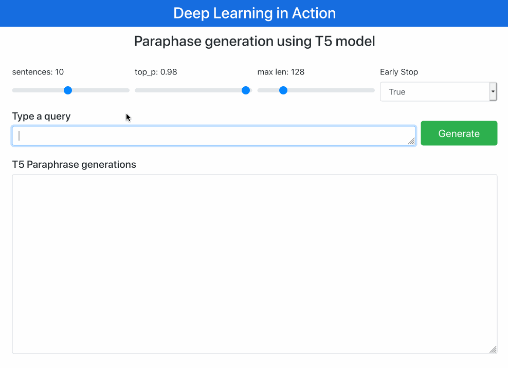

# Paraphrase generation using T5 model
Simple application using T5 base model fine tuned in Quora Question Pairs to generate paraphased questions.

This repository is based on work from @ramsrigouthamg (https://github.com/ramsrigouthamg/Paraphrase-any-question-with-T5-Text-To-Text-Transfer-Transformer-) wich explain how to fine tune and provide the fine tuned model.


### Application




### Install

```
pip install -r requirements.txt
```


### Running 

```
cd web-app
python app.py
```

Open your browser http://localhost:8000


